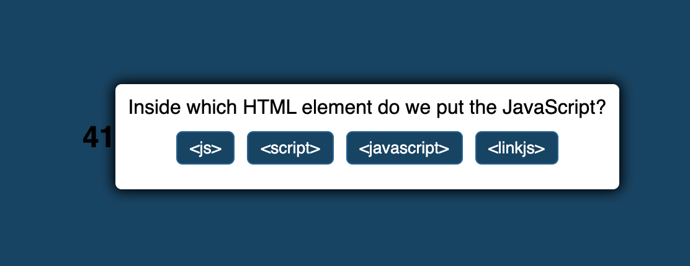

# maleaque-quiz-challenge

## Description
 The motivation behind this project was to not only assist myself and others who are in need of a short quiz, but to display my skills in JS.
 I built this project mainly to showcase my programming using Javascript. This short program will solve issues regarding certain questions. You'll never need to sit and brainstorm for these select answers, it's now easier than ever. I learned many elements of JS throughout this project including: null and its cause.

## Usage
Here's a screenshot showing a mockup of what should appear when loading up the program.

Here's a link to the repo:
https://github.com/marsmeshed/maleaque-quiz-challenge

Deployed site:
https://marsmeshed.github.io/maleaque-quiz-challenge/

## Installation

No special steps needed for installation, just a stable connection. Click the URL and it'll be ready for instant use.

## License

MIT License

Copyright (c) 2022 marsmeshed

Permission is hereby granted, free of charge, to any person obtaining a copy
of this software and associated documentation files (the "Software"), to deal
in the Software without restriction, including without limitation the rights
to use, copy, modify, merge, publish, distribute, sublicense, and/or sell
copies of the Software, and to permit persons to whom the Software is
furnished to do so, subject to the following conditions:

The above copyright notice and this permission notice shall be included in all
copies or substantial portions of the Software.

THE SOFTWARE IS PROVIDED "AS IS", WITHOUT WARRANTY OF ANY KIND, EXPRESS OR
IMPLIED, INCLUDING BUT NOT LIMITED TO THE WARRANTIES OF MERCHANTABILITY,
FITNESS FOR A PARTICULAR PURPOSE AND NONINFRINGEMENT. IN NO EVENT SHALL THE
AUTHORS OR COPYRIGHT HOLDERS BE LIABLE FOR ANY CLAIM, DAMAGES OR OTHER
LIABILITY, WHETHER IN AN ACTION OF CONTRACT, TORT OR OTHERWISE, ARISING FROM,
OUT OF OR IN CONNECTION WITH THE SOFTWARE OR THE USE OR OTHER DEALINGS IN THE
SOFTWARE.
